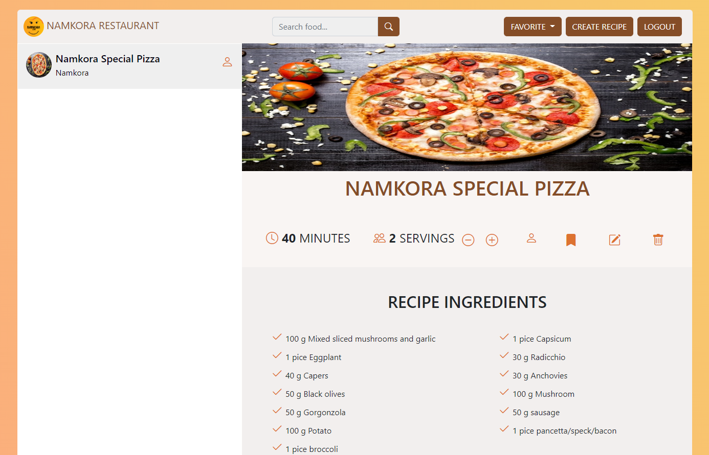

# Namkora Restaurant

A restaurant web application using vanilla JavaScript.

See Live: [https://restaurant.namkora.com/](https://restaurant.namkora.com/)



## User Manual

You can create a `Namkora Account` as a `CUSTOMER` or `ADMIN`.

To create an `ADMIN` account you need to `check` the `[ ] Request for ADMIN Account.` option during registration.

By default all registered accounts are `CUSTOMER` type.

Without logged in user will be treated as `ANONYMOUS` user.

## Developer Instractions

- CLone this repository
- Go to root directory of this repository
- Then open your `terminal/command prompt`
- Install packages using `npm install` command

Then...

To run the development server:

```shell
npm start
```

Then you will see similar to `Server running at http://localhost:1234`. Then open your browser and go to this URL [http://localhost:1234](http://localhost:1234).

To build the applocation:

```shell
npm run build
```

## The Given Requirements

Develop an website for restaurant.
There will be two types of end user (1. Admin, 2. Customer/anonymous user)

Admin features:

1. Admin will be able to login to the system. (initially keep a hard-coded credential for admin)
2. Will be able to add/update/remove recepies

Customer features:

1. Customer will be able to view(list) or search any reciepe from the list
2. Will be able to add any reciepe to his favorite list
3. Login is optional for (1 & 2)
4. Will be able to login & registration
5. Logged in user will be able to see his favorite listed recipes if he logs in after logout. that means, registered users data will be persistent.

Constraints:

1. No api call is allowed. All data should be handled inside browser.
2. No third party library/framework is allowed except some dev dependency like (scss/tailwind etc.)

## Note

This application developed only for learning purpose. Be aware about the bugs and unexpected behabiors while using this application. I tried my best to build a simple restaurant application using vanilla JavaScript.

Thank you!
